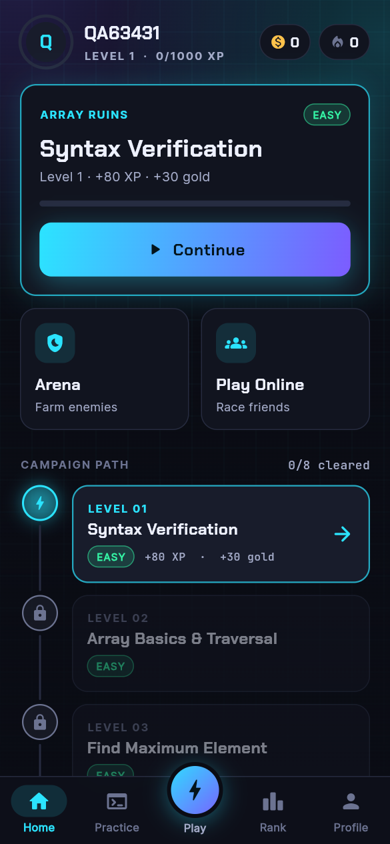
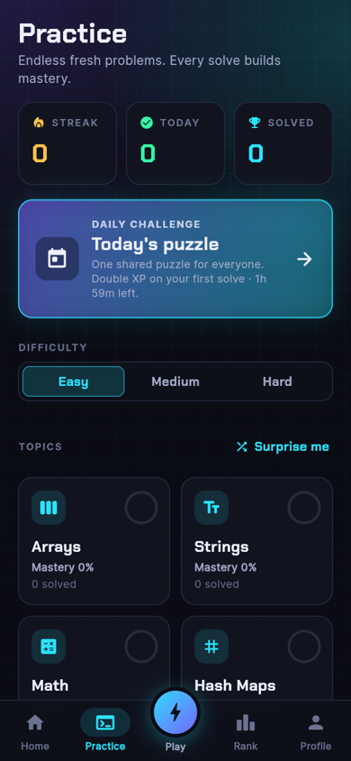
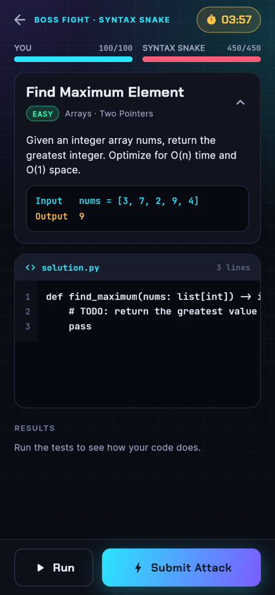
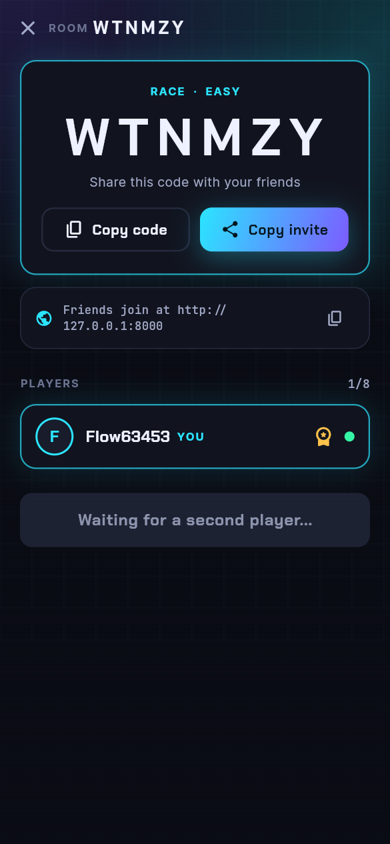
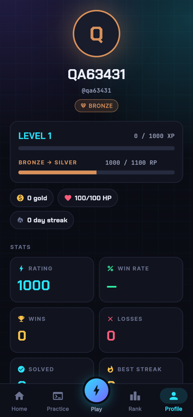

# CodeWar

**Fight enemies, race your friends and climb the ranks by solving coding problems.**

CodeWar is a coding game. Beat campaign enemies, grind endless practice problems, or create a room and race friends live with a 6-character code. A server writes fresh problems, judges your code in Python or TypeScript, and keeps a real leaderboard.

<p align="center">
  
  
  
  
  
</p>

## Run it on your computer (about 5 minutes)

You do **not** need to host anything or pay for anything. Everything runs on your PC and opens in your browser.

### 1. Install the tools (once)

| Tool | Why | Get it |
|---|---|---|
| **Python 3.10 or newer** | runs the game server | https://www.python.org/downloads/ (tick "Add Python to PATH") |
| **Flutter SDK** | builds the game screen (only needed once) | https://docs.flutter.dev/get-started/install |
| *Node.js 22.18 or newer* (optional) | only if you want to write answers in TypeScript | https://nodejs.org |

Check they work: open a terminal and run `python --version` and `flutter --version`.

### 2. Build the game screen (once)

```bash
cd frontend/codewar
flutter pub get
flutter build web
cd ../..
```

### 3. Start the game

- **Windows:** double-click **`play.bat`**
- **Mac / Linux:** run `./play.sh`

The first start installs the server's Python packages by itself (about a minute). Your browser then opens **http://127.0.0.1:8000**. Pick a name and play. Close the window (or press `Ctrl+C`) to stop.

That's it.

### Play with friends

- **On the same Wi-Fi:** the start-up window prints an address like `http://192.168.1.23:8000`. Friends open it in their browser, pick a name, then use **Play > Join with a code**. Allow Python through the Windows Firewall if it asks.
- **Over the internet:** run `run_server.ps1` without `-NoTunnel` to get a free public link (needs `cloudflared`, see [docs/DEVELOPMENT.md](docs/DEVELOPMENT.md)). Your computer must stay on while people play.

### Something went wrong?

| Problem | Fix |
|---|---|
| Browser shows "This site can't be reached" | The server is not running. Start `play.bat` / `play.sh` again and keep its window open. |
| The page says the web app is not built | Do step 2 (`flutter build web`), then restart. |
| `python` is not recognised | Reinstall Python and tick "Add Python to PATH", then open a new terminal. |
| TypeScript answers fail with "runtime is not available" | Install Node.js 22.18 or newer, then restart the server. Python works without it. |
| Friends can't open the Wi-Fi address | Same Wi-Fi? Firewall prompt allowed? Some guest/office networks block device-to-device traffic. |
| "That name is taken" | Names are unique. Choose another. |
| Start over with a clean game | Stop the server and delete `backend/codewar.db`. |

## What's inside the game

- **Campaign:** a level path of enemies, one coding problem each. Wrong answers cost HP, winning gives XP and gold.
- **Endless Practice:** pick a topic and difficulty, get a fresh problem every time. Hints, per-topic mastery, a day streak and a daily challenge with double XP.
- **Online rooms:** **Race** (2 to 8 players) or **Duel** (1v1). Share the room code, race the same problem live, and see progress bars update in real time. Ratings (Elo), XP and friends update when the match ends.
- **Leaderboard:** global, weekly or friends, by total XP or online rating. Updates every 15 seconds and every row is a real player.
- **Rank tiers and badges:** Iron to Diamond from your rating, plus 17 badges earned only by real achievements.
- **Profile:** tier progress, win rate, best streak, match history with rating changes, topic mastery.
- **Fair problems:** a built-in generator with 34 problem templates and random inputs. The correct answers always come from running a reference solution through the same judge that grades you.
- **Sound and haptics** with on/off switches in Settings.

Optional: set the `ANTHROPIC_API_KEY` environment variable before starting the server and an AI model will write extra, more varied problems (always verified by the judge). Without it, the built-in generator is used.

## For developers

```bash
# Server tests (about 40 seconds)
cd backend && python -m pytest -q          # use .venv/Scripts/python on Windows after the first start

# App tests and lint
cd frontend/codewar && flutter analyze && flutter test
```

| Folder | What it is |
|---|---|
| `frontend/codewar/` | the Flutter app (runs on web, Android, iOS, desktop) |
| `backend/` | the FastAPI server: accounts, problems, code judge, rooms, leaderboard (SQLite database) |
| `docs/` | architecture, API reference, development guide, design notes |
| `tools/` | screenshot and end-to-end test scripts, sound generator |
| `play.bat`, `play.sh`, `run_server.ps1` | start scripts |

More documentation:

- [Architecture](docs/ARCHITECTURE.md): how the pieces fit together
- [API reference](docs/API.md): every endpoint, and the [room protocol](docs/rooms-protocol.md) for live matches
- [Development guide](docs/DEVELOPMENT.md): tests, tools, the code judge, the design system, running on a phone
- [Design notes](docs/design/): the original specs

## Good to know

- The code judge runs submissions in a time-limited subprocess on your computer **without a sandbox**. That is fine for you and friends you trust, but do not expose the server to strangers on the open internet.
- Online rooms live in the server's memory, so restarting the server ends rooms in progress. Finished matches, ratings and XP are saved in the database.
- Accounts are just a display name plus a secret key stored on your device (no email or password). Clearing the browser's site data means losing that account.
